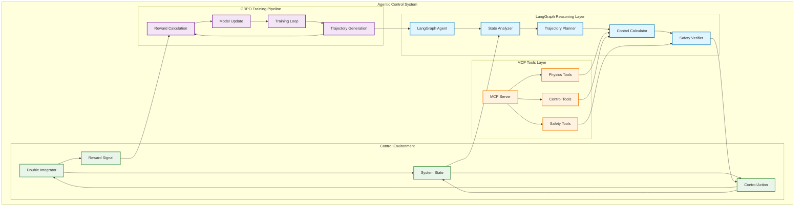
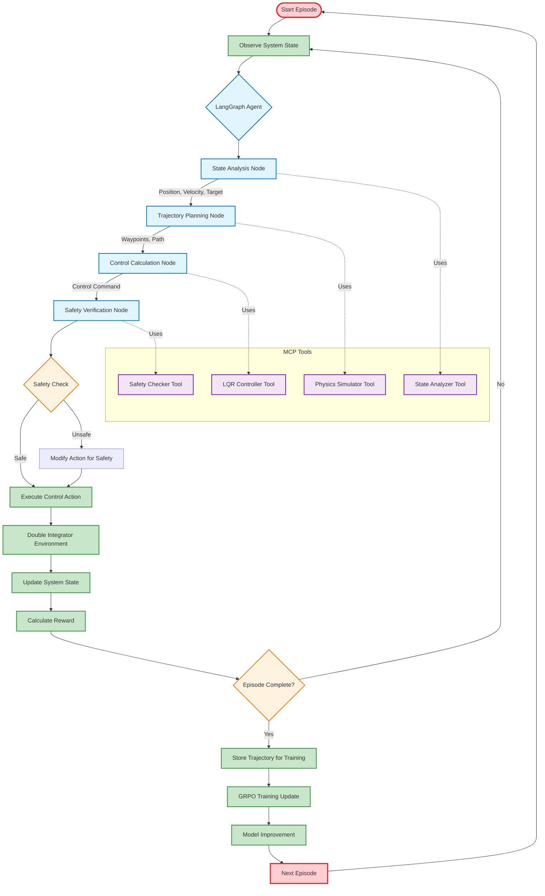
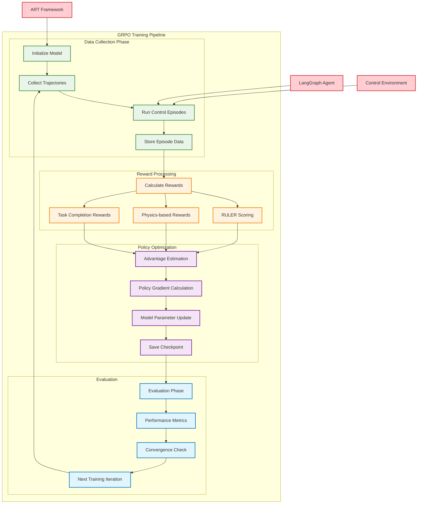
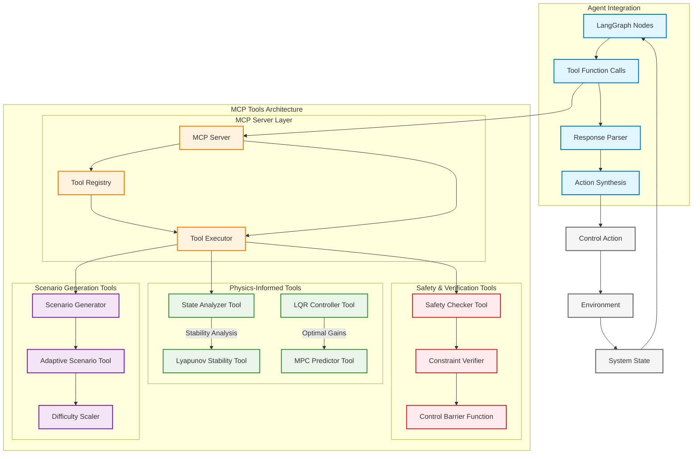

# Agentic Control System Architecture Diagram

## Overview

This document provides the specifications for creating comprehensive flowcharts and diagrams to illustrate the agentic control system architecture, integrating LangGraph reasoning, GRPO training, and MCP tools for advisor presentation.

## Diagram 1: High-Level System Architecture

### Description
Shows the overall system with three main components: LangGraph Agent, GRPO Training Pipeline, and Control Environment, connected through the ART framework.

### Mermaid Code


## Diagram 2: Detailed Agentic Loop Flow

### Description
Shows the step-by-step flow of the agentic control loop, from state observation to action execution.

### Mermaid Code


## Diagram 3: GRPO Training Pipeline Detail

### Description
Detailed view of the GRPO training process showing how trajectories are collected, rewards calculated, and model updated.

### Mermaid Code


## Diagram 4: MCP Tools Integration Architecture

### Description
Shows how MCP (Model Context Protocol) tools integrate with the agentic system to provide physics-informed reasoning.

### Mermaid Code


## Code to Generate Diagrams

I'll create Python scripts to generate these diagrams using various tools:

### Method 1: Using Mermaid (Recommended)
```python
# File: generate_diagrams.py
import os
import subprocess
from pathlib import Path

def generate_mermaid_diagram(mermaid_code, output_file, title):
    """Generate diagram from Mermaid code"""
    
    # Create mermaid file
    mmd_file = f"{output_file}.mmd"
    with open(mmd_file, 'w') as f:
        f.write(mermaid_code)
    
    # Generate PNG using mermaid-cli
    try:
        subprocess.run([
            'mmdc', 
            '-i', mmd_file,
            '-o', f"{output_file}.png",
            '-t', 'default',
            '--width', '1200',
            '--height', '800'
        ], check=True)
        
        print(f"✅ Generated {output_file}.png")
        
        # Clean up mermaid file
        os.remove(mmd_file)
        
    except subprocess.CalledProcessError:
        print(f"❌ Failed to generate {output_file}. Install mermaid-cli: npm install -g @mermaid-js/mermaid-cli")
    except FileNotFoundError:
        print("❌ mermaid-cli not found. Install with: npm install -g @mermaid-js/mermaid-cli")

# Diagram specifications (insert the Mermaid code from above)
diagrams = {
    "system_architecture": {
        "title": "High-Level System Architecture",
        "code": """[Insert Mermaid code for Diagram 1]"""
    },
    "agentic_loop": {
        "title": "Detailed Agentic Loop Flow", 
        "code": """[Insert Mermaid code for Diagram 2]"""
    },
    "grpo_pipeline": {
        "title": "GRPO Training Pipeline",
        "code": """[Insert Mermaid code for Diagram 3]"""
    },
    "mcp_architecture": {
        "title": "MCP Tools Integration",
        "code": """[Insert Mermaid code for Diagram 4]"""
    }
}

if __name__ == "__main__":
    output_dir = Path("docs/diagrams")
    output_dir.mkdir(exist_ok=True)
    
    for name, spec in diagrams.items():
        output_path = output_dir / name
        generate_mermaid_diagram(spec["code"], str(output_path), spec["title"])
```

### Method 2: Using Graphviz (Alternative)
```python
# File: generate_graphviz_diagrams.py
import graphviz

def create_system_overview():
    """Create high-level system overview using Graphviz"""
    
    dot = graphviz.Digraph('agentic_control_system')
    dot.attr(rankdir='TB', size='12,8')
    
    # Define node styles
    dot.attr('node', shape='box', style='rounded,filled')
    
    # LangGraph Layer
    with dot.subgraph(name='cluster_langgraph') as lg:
        lg.attr(label='LangGraph Reasoning Layer', color='blue')
        lg.node('agent', 'LangGraph Agent', fillcolor='lightblue')
        lg.node('state_analyzer', 'State Analyzer', fillcolor='lightblue')
        lg.node('trajectory_planner', 'Trajectory Planner', fillcolor='lightblue')
        lg.node('control_calc', 'Control Calculator', fillcolor='lightblue')
        lg.node('safety_verifier', 'Safety Verifier', fillcolor='lightblue')
    
    # MCP Tools Layer
    with dot.subgraph(name='cluster_mcp') as mcp:
        mcp.attr(label='MCP Tools Layer', color='orange')
        mcp.node('mcp_server', 'MCP Server', fillcolor='lightyellow')
        mcp.node('physics_tools', 'Physics Tools', fillcolor='lightyellow')
        mcp.node('control_tools', 'Control Tools', fillcolor='lightyellow')
        mcp.node('safety_tools', 'Safety Tools', fillcolor='lightyellow')
    
    # GRPO Training
    with dot.subgraph(name='cluster_training') as train:
        train.attr(label='GRPO Training Pipeline', color='purple')
        train.node('train_loop', 'Training Loop', fillcolor='plum')
        train.node('traj_gen', 'Trajectory Generation', fillcolor='plum')
        train.node('reward_calc', 'Reward Calculation', fillcolor='plum')
        train.node('model_update', 'Model Update', fillcolor='plum')
    
    # Control Environment
    with dot.subgraph(name='cluster_env') as env:
        env.attr(label='Control Environment', color='green')
        env.node('double_integrator', 'Double Integrator', fillcolor='lightgreen')
        env.node('system_state', 'System State', fillcolor='lightgreen')
        env.node('control_action', 'Control Action', fillcolor='lightgreen')
        env.node('reward_signal', 'Reward Signal', fillcolor='lightgreen')
    
    # Add edges
    dot.edge('agent', 'state_analyzer')
    dot.edge('state_analyzer', 'trajectory_planner') 
    dot.edge('trajectory_planner', 'control_calc')
    dot.edge('control_calc', 'safety_verifier')
    dot.edge('safety_verifier', 'control_action')
    
    # Cross-layer connections
    dot.edge('physics_tools', 'control_calc', style='dashed')
    dot.edge('safety_tools', 'safety_verifier', style='dashed')
    dot.edge('traj_gen', 'agent', style='dashed')
    dot.edge('reward_signal', 'reward_calc', style='dashed')
    
    return dot

if __name__ == "__main__":
    # Generate system overview
    system_diagram = create_system_overview()
    system_diagram.render('docs/diagrams/system_overview_graphviz', format='png', cleanup=True)
    print("✅ Generated system overview diagram")
```

## Installation Instructions

To generate the diagrams, you'll need to install the required tools:

### For Mermaid Diagrams (Recommended):
```bash
# Install Node.js and mermaid-cli
npm install -g @mermaid-js/mermaid-cli

# Or using conda
conda install -c conda-forge nodejs
npm install -g @mermaid-js/mermaid-cli
```

### For Graphviz Diagrams:
```bash
# Install graphviz
conda install graphviz python-graphviz

# Or using pip
pip install graphviz
```

## Presentation-Ready Versions

I'll also create presentation-ready versions with:
- High-resolution outputs (300 DPI)
- Professional color schemes
- Clear typography for projectors
- Multiple formats (PNG, PDF, SVG)

Would you like me to:
1. Generate the actual diagram files using Mermaid?
2. Create additional specialized diagrams (e.g., training timeline, performance comparison)?
3. Add more detailed technical annotations for specific components?

The flowcharts clearly show how LangGraph provides the reasoning layer, GRPO handles the learning optimization, and MCP tools provide physics-informed capabilities - all working together in the agentic control loop!